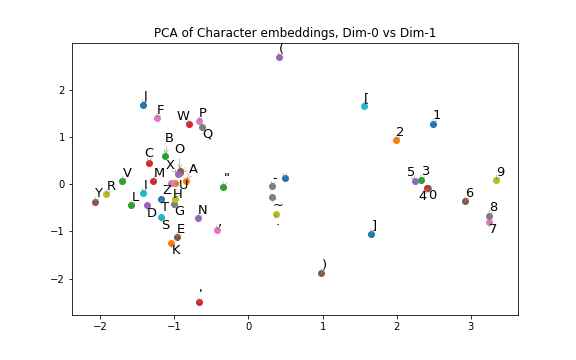
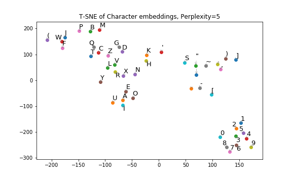

# Char2Vec
Character embedding following word-vector Word2Vec. (Work-in-progress)

---

## Visualized embeddings:
_(Training demo notebook: https://github.com/sonlamho/Char2Vec/blob/master/docs/demo.ipynb )_

This is the result after training on a small corpus of a single Wikipedia page. The model naturally learn to group characters into:
- Digits `0-9`;
- Alphabet `A-Z`;
- Left brackets `(,[` vs right brackets `),]`.



Note that `1` and `9` are quite distinct from other digits because years such as `"19XX"` appears quite often in the corpus.

---

More subtle grouping like vowels vs consonants can also be learned at the same time:
- Notice `A,E,I,O,U` hanging out in their own group, with `Y` trying to join the club.



---

Note:

* This repo is aiming for code clarity instead of fast performance

---

## General idea:

Below we briefly describe the general idea of this Char2Vec implementation. Readers who know the details of Word2Vec before hand will recognize the familiar themes.

A character's "meaning" is in its usage. We will construct a simple neural net (with only 2 weight matrices) which will take a 1-hot encoding of a character as input and predict the character's _context vector_ (the distribution of surrounding characters) as output.

Given a character `C[i]` in the text corpus, let `x` be its 1-hot encoding (row) vector. (`x` has dimension `v`, the size of the chosen _alphabet_ of recognizable characters.) Let `y` be its _context vector_ of dimension `2*k*v`- we will discuss the construction of `y` later. We aim to learn parameter matrices `U` (of shape `(v, d)`) and `W` (of shape `(d, 2*k*v)`) such that:

`y ~ sigmoid(x . U . W)`

Indeed `x . U` (a vector of dimension `d`), is the dense embedding of the character.

In short, we want to learn a `d`-dimensional dense embedding of `x` so that from the dense embedding, the context `y` can be recovered as best as possible. Matrix `U` takes care of _embedding_ `x`, and matrix `W` takes care of _recovering_ the context `y`.

### How the _context vector_ is constructed:
There is the **ideal** context vector and the **practical** one. The `y` in the above section is the **ideal** context vector.

#### (a) The ideal context vector:

For each character `C[n]` in the text corpus, we consider the window of `2*k` characters surrounding it:
```
C[n-k],...,C[n-1],C[n+1],...,C[n+k]
```
(In practice choosing `k = 3` gives decent result). For `i=-k,..,-1,1,..,k`, we consider the following probability distributions:
```
p(C[n+i]|C[n])
```
In words, the above is a discrete probability distribution (conditioned on `C[n]`) describing which characters are likely to appear at position `i` relative to the center character `C[n]`. Each of these probability distribution is an array length `v` with entries summing up to `1`. We have `2*k` such arrays, they can be concatenated into an array of length `2*k*v`, this is our ideal context vector `y`.

#### (b) The practical context vector:

(To be continued)
